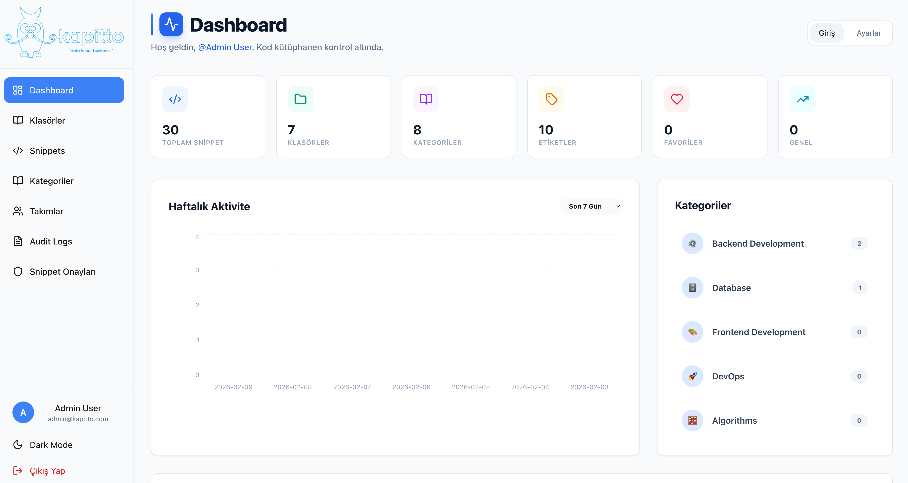
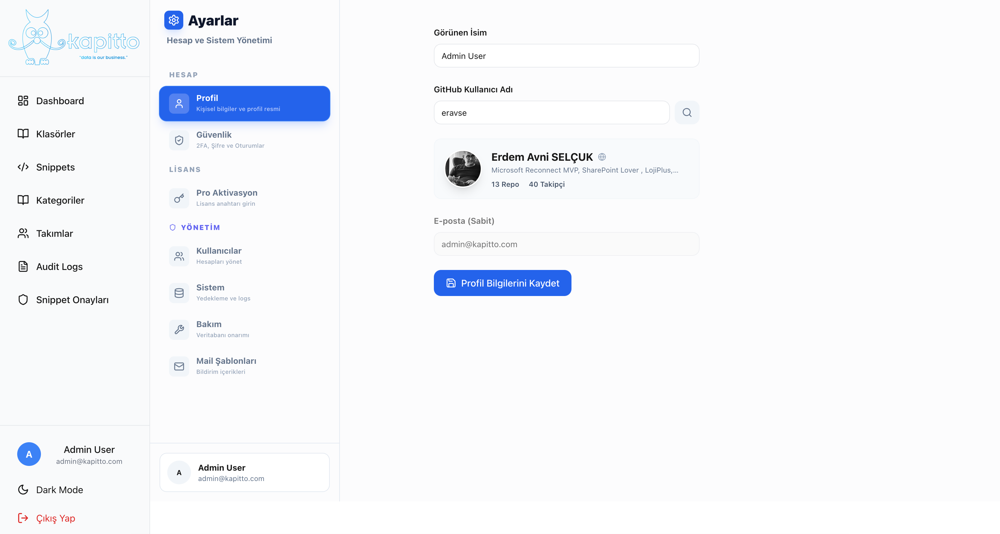
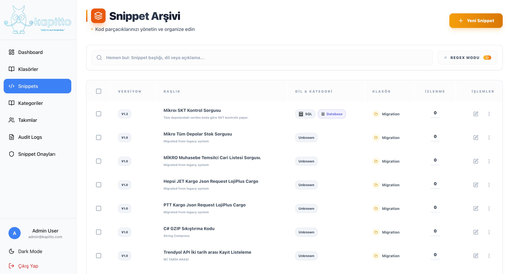
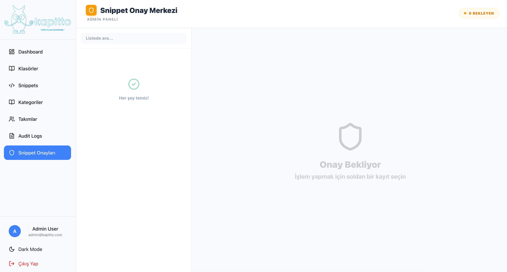

# Kapitto Snippet Manager v2.1 (Pro)

Modern, güvenli ve kurumsal odaklı Kod Parçacığı Yönetim Sistemi.
Tamamen yerel çalışır, verilerinizi asla dışarı sızdırmaz.


## 🚀 v2.1 Yenilikleri & Pro Özellikler

Kapitto v2.1, profesyonel geliştiriciler ve ekipler için tasarlanmış güçlü özelliklerle gelir:

- **Source Control Entegrasyonu (Pro)**: Kod parçalarınızı doğrudan **GitHub (Gist/Repo)** veya **Gitea**'ya gönderin.
- **Lisans Yönetimi (Pro)**: Gelişmiş özelliklerin kilidini açan esnek lisanslama sistemi.
- **Güvenlik Kalkanı (Pro)**: IP tabanlı erişim kontrolü (Whitelist/Blacklist) ve DoS koruması.
- **Gelişmiş Admin Paneli**: Onay süreçleri için split-view arayüz ve detaylı denetim kayıtları (Audit Logs).
- **Veri Taşıma Araçları**: Eski sistemlerden (v1.x) kolay geçiş sihirbazı.

> **Detaylı Dokümantasyon:**
> - [Modül Rehberi](docs/modules.md) - Sistem modülleri hakkında bilgi.
> - [Pro Özellikler](docs/pro-features.md) - Lisanslama ve entegrasyon detayları.
> - [Sürüm Geçmişi](docs/changelog.md) - Değişiklik günlüğü.

## 📸 Galeri

Uygulama arayüzünden görünümler:

| Ana Panel                                  | Pro Ayarlar                         |
|--------------------------------------------|-------------------------------------|
|  |  |

| Snippet Detay                    | Admin Onay                                  |
|----------------------------------|---------------------------------------------|
|  |  |

## 🎯 Temel Özellikler

- ✅ **SQLite Veritabanı**: Hızlı, hafif ve tamamen yerel depolama.
- ✅ **Prisma ORM**: Tip-güvenli ve hatasız veritabanı etkileşimi.
- ✅ **Next.js 15 & React 19**: En güncel teknoloji yığını ile yüksek performans.
- ✅ **Monaco Editor**: VS Code kalitesinde kod düzenleme deneyimi.
- ✅ **Dark/Light Mode**: Göz yormayan tema seçenekleri.
- ✅ **Responsive**: Her cihazda kusursuz görünüm.

## 🚀 Kurulum

### 1. Hazırlık
Gereksinimler: Node.js 18+ veya 20+

```bash
# Bağımlılıkları yükle
npm install
# veya
yarn install
```

### 2. Veritabanı Kurulumu

```bash
# Veritabanı oluştur ve şemayı uygula
npm run db:push

# Örnek verileri yükle (Admin kullanıcısı ve temel ayarlar)
npm run db:seed
```

> **Not:** `admin@kapitto.com` / `1q2w3e` ile giriş yapabilirsiniz.

### 3. Başlatma

```bash
npm run dev
# http://localhost:3000 adresine gidin
```

## 📊 Veritabanı & Modüller

Uygulama aşağıdaki ana veri yapıları üzerine kuruludur:

- **Snippets**: Kod parçacıkları, versiyonlar ve metadata.
- **Users & Auth**: Rol tabanlı (Admin/User) kullanıcı yönetimi.
- **Folders**: Sınırsız derinlikte hiyerarşik klasörleme.
- **Integrations**: GitHub/Gitea token yönetimi (Şifreli saklanır).

Daha fazlası için [Modül Dokümantasyonu](docs/modules.md)'na göz atın.

## 🛠️ Geliştirici Komutları

```bash
npm run db:studio      # Veritabanı GUI (Prisma Studio)
npm run db:generate    # Prisma Client'ı yeniden oluştur
npm run build          # Production build al
npm start              # Production modunda başlat
```

## 📁 Proje Yapısı

```
SnippetManager/
├── app/
│   ├── api/             # Backend API endpointleri
│   ├── dashboard/       # Kullanıcı paneli
│   ├── admin/           # Yönetici paneli ve onay süreçleri
│   └── profile/         # Ayarlar ve Entegrasyonlar
├── components/          # React bileşenleri (UI Kit)
├── docs/                # Sistem dokümantasyonu
├── images/              # Galeri ve görsel varlıklar
├── lib/                 # Yardımcı fonksiyonlar (Auth, License, DB)
└── prisma/              # Veritabanı şeması ve seed
```

## 📝 Lisans

MIT License. Kurumsal kullanım ve destek için iletişime geçin.
